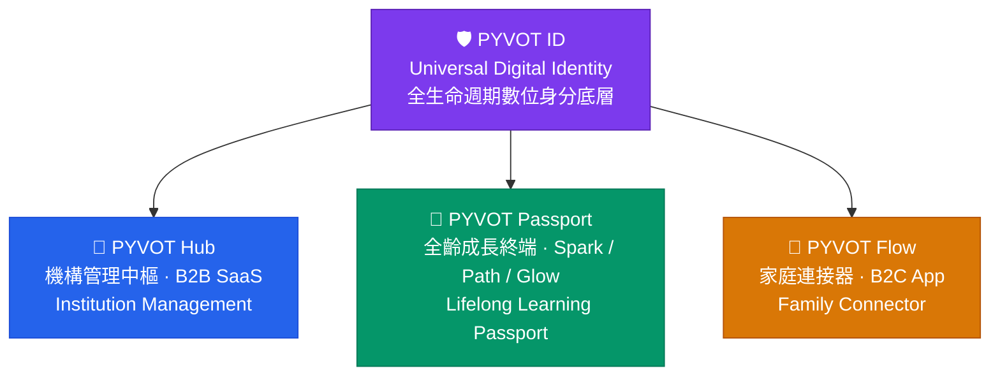

<!-- Animated header banner -->

<!-- Typing animation tagline -->

 

<!-- Badges -->

  
  
  
  
  
  

 

---

## 關於 PYVOT &nbsp;|&nbsp; About

<table>
<tr>
<td width="50%" valign="top">

PYVOT 是一個以**幼兒教育**為起點的全齡成長平台，致力於將機構管理、兒童學習與家庭溝通整合在同一個生態系中。

我們相信：**每一分成長都值得被量化、被紀錄、被傳承。**

從孩子在幼兒園的第一次遊戲互動，到未來橫跨十年的學習軌跡，PYVOT ID 確保這些數據永不斷層。

</td>
<td width="50%" valign="top">

PYVOT is a lifelong growth platform rooted in early childhood education, unifying institutional management, child learning, and family communication in a single ecosystem.

We believe: **every moment of growth deserves to be measured, remembered, and passed on.**

From a child's first game interaction in kindergarten to a decade of learning records, PYVOT ID ensures this data is never lost.

</td>
</tr>
</table>

 

<!-- Animated divider -->

 

## 🏛️ 產品生態系 &nbsp;|&nbsp; Product Ecosystem

 

### 🏫 PYVOT Hub — 園所管理中樞 &nbsp;|&nbsp; Institution Management

<table>
<tr>
<td width="50%" valign="top">

讓老師回歸教學，讓成長看得到數據。

| 模組 | 功能 |
|------|------|
| 🎓 學員管理 | 唯一數位學籍，入園到畢業完整存檔 |
| 📋 智慧考勤 | QR Code 簽到，即時推播家長 |
| 📅 課程排程 | 彈性排課，自動同步家長端 |
| 📊 學習分析 | 班級 / 個人能力雷達圖自動生成 |
| 💰 財務管理 | 電子繳費通知，多元支付對帳 |
| 📢 公告推播 | 全頻道訊息，零漏看率 |

</td>
<td width="50%" valign="top">

Let teachers focus on teaching, let growth speak in data.

| Module | Feature |
|--------|---------|
| 🎓 Enrollment | Unique digital profile, full academic record |
| 📋 Attendance | QR Code check-in, instant parent notification |
| 📅 Scheduling | Flexible timetable, auto-synced to parent app |
| 📊 Analytics | Auto-generated class / individual ability radar |
| 💰 Finance | Digital invoicing, multi-payment reconciliation |
| 📢 Broadcast | Omni-channel announcements, zero miss-rate |

</td>
</tr>
</table>

---

### 🚀 PYVOT Passport [Spark] — 幼兒成長終端 &nbsp;|&nbsp; Early Learning Passport

<table>
<tr>
<td width="50%" valign="top">

2–6 歲的沉浸式學習護照，讓每一局遊戲都成為成長數據。

- 🎮 **益智遊戲** — 識字、自然發音、數感空間，全程語音導覽，無需識字即可操作
- 🕸️ **能力雷達圖** — 多維度呈現專注力、邏輯力、語言力輪廓
- 🏅 **成就獎章** — 積分制激勵，可下載年度學習證書
- 👩‍🏫 **教師看板** — 全班能力分佈一覽，個別學生建議自動生成

</td>
<td width="50%" valign="top">

An immersive learning passport for ages 2–6, turning every game session into growth data.

- 🎮 **Learning Games** — Chinese characters, phonics, math concepts; fully voice-guided, no reading required
- 🕸️ **Ability Radar** — Multi-dimensional profile: focus, logic, language, creativity
- 🏅 **Achievement Badges** — Gamified rewards with printable annual certificates
- 👩‍🏫 **Teacher Dashboard** — Class-wide ability heatmap, per-child suggestions auto-generated

</td>
</tr>
</table>

---

### 💬 PYVOT Flow — 家庭連接器 &nbsp;|&nbsp; Family Connector

<table>
<tr>
<td width="50%" valign="top">

親師溝通的即時橋梁，讓家長隨時掌握孩子的校園生活。

- 📸 **成長紀錄牆** — 照片、影片、學習里程碑即時分享
- 📆 **行事曆同步** — 課表與活動自動推播至家長手機
- 🔔 **任務提醒** — 帶藥囑託、物品清單貼心通知
- 💬 **即時通訊** — WebSocket 驅動，訊息送達零延遲

</td>
<td width="50%" valign="top">

A real-time bridge between teachers and families, keeping parents always in the loop.

- 📸 **Growth Wall** — Photos, videos, and milestones shared instantly
- 📆 **Calendar Sync** — Schedules and events auto-pushed to parent devices
- 🔔 **Task Reminders** — Medication reminders, item checklists, proactive alerts
- 💬 **Live Chat** — WebSocket-powered messaging with zero-delay delivery

</td>
</tr>
</table>

 

<!-- Divider -->

 

## ⚙️ 平台基礎系統 &nbsp;|&nbsp; Platform Infrastructure

除三大核心產品外，PYVOT 平台內建多項通用管理模組，開箱即用。  
Beyond the three core products, PYVOT ships with built-in operational modules, ready out of the box.

| 系統 / System | 用途 / Purpose |
|:---|:---|
| 📋 **問卷調查** Survey | 家長滿意度調查、學生學習反饋收集 · Parent satisfaction surveys & student feedback |
| 🎫 **工單系統** Ticketing | 客服請求追蹤、問題回報與流程管理 · Support request tracking & issue lifecycle management |
| 🔔 **通知中心** Notification Hub | App 推送、站內通知、Email 全頻道 · Push, in-app, and email notification delivery |
| 📈 **報表系統** Reporting | 成長數據匯出、機構營運報表自動生成 · Growth data export & auto-generated ops reports |
| 🌐 **多語系** i18n | 繁體中文 / English / 日本語 · zh-TW / en / ja |

 

<!-- Divider -->

 

## 🛠️ 技術架構 &nbsp;|&nbsp; Technology Stack

**Backend**

**Frontend**

**Observability & DevOps**

 

<table>
<tr>
<td width="50%" valign="top">

**後端服務層**

| 技術 | 用途 |
|------|------|
| .NET 10 / ASP.NET Core | 微服務框架，6 個獨立 Domain Service |
| YARP Reverse Proxy | API 閘道，JWT 驗證 + 路由分發 |
| Keycloak | OIDC / OAuth 2.0 / RBAC 身分管理 |
| PostgreSQL | 多 Schema 架構，各服務資料隔離 |
| Redis | 高頻查詢快取加速 |
| WebSocket / SSE / Web Push | 即時通訊三模態 |

</td>
<td width="50%" valign="top">

**前端應用層**

| 技術 | 用途 |
|------|------|
| Next.js 15 App Router | 四個獨立 App（Hub / Flow / Parent / Spark）|
| React 19 | UI 渲染層 |
| Turborepo + pnpm | Monorepo 工作區管理 |
| Tailwind CSS 4 + Radix UI | 共用設計系統 `@pyvot/ui` |
| next-auth + Keycloak | PKCE 安全認證流程 |
| next-intl | zh-TW / en / ja 三語支援 |

</td>
</tr>
</table>

 

<!-- Divider -->

 

## 🗺️ 產品路線圖 &nbsp;|&nbsp; Roadmap

| 階段 / Phase | 重點 / Focus | 狀態 / Status |
|:---:|:---|:---:|
| **🌱 Phase 1 — Seed** | Hub [Lite] + Passport [Spark 2–6歲] · 首批種子園所簽約驗證 B2B2C 路徑 | 🟢 **進行中** |
| **📈 Phase 2 — Growth** | PYVOT Flow 全功能 · 家長 DAU 成長 · 數據生態完整建立 | 🔵 規劃中 |
| **🌍 Phase 3 — Vision** | Passport [Path 7–18歲] + [Glow 70+歲] · PYVOT ID 跨場域數據串接 | ⚪ 未來 |

 

<!-- Divider -->

 

## 💼 商業模式 &nbsp;|&nbsp; Business Model

| 模式 / Model | 對象 / Target | 說明 / Description |
|:---|:---|:---|
| 🏫 **B2B** 機構年費訂閱 | 幼教機構 | 依園所規模彈性分層定價，含 Hub 全功能與 Passport 教學內容授權 · Tiered annual subscription with full Hub access and Passport content license |
| 👨‍👩‍👧 **B2C** 家長進階方案 | 家長用戶 | 在家延伸使用 Spark，每月訂閱制，與機構採收入分潤模型 · Monthly parent subscription with institution revenue sharing |
| 🏛️ **政策切入** 幼教補助 | 幼教機構 | 配合政府幼教數位化政策，協助機構申請轉型補助，降低導入門檻 · Assist institutions in applying for government EdTech digitization grants |

 

---

## 📬 聯絡我們 &nbsp;|&nbsp; Contact

有合作提案、投資洽談或系統諮詢，歡迎與我們聯繫。  
*For partnerships, investment inquiries, or product consultations, we'd love to hear from you.*

 

📧 **contact@pyvot.uk**

 

<!-- Footer wave -->

